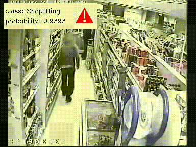

# Anomaly detection pipeline

## Description

This is an example of action recognition pipeline trained on [UCF-Crime dataset](https://www.crcv.ucf.edu/projects/real-world/) to detect anomaly behavior among next classes: 'Normal', 'Fighting', 'Robbery', 'Shoplifting', 'Stealing'.

